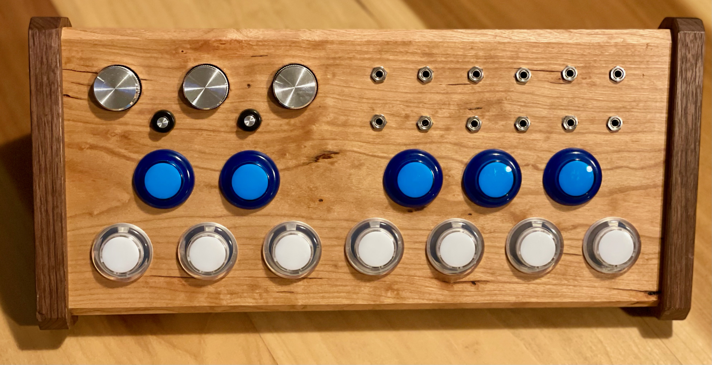
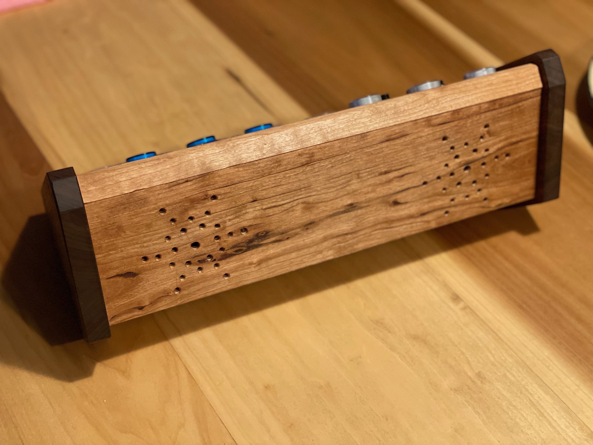
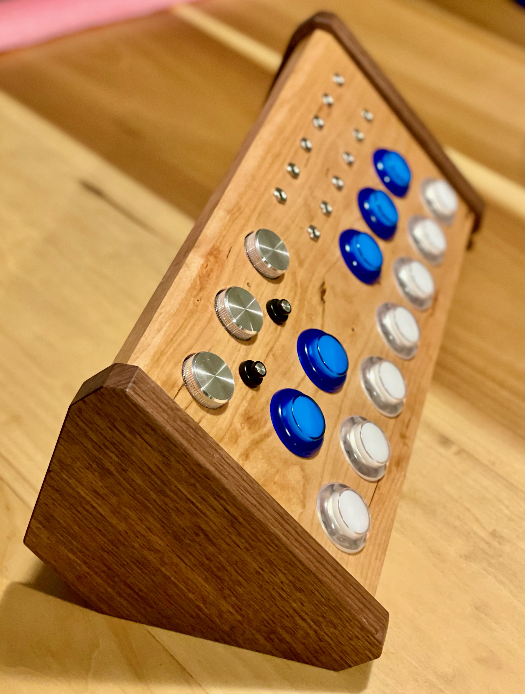
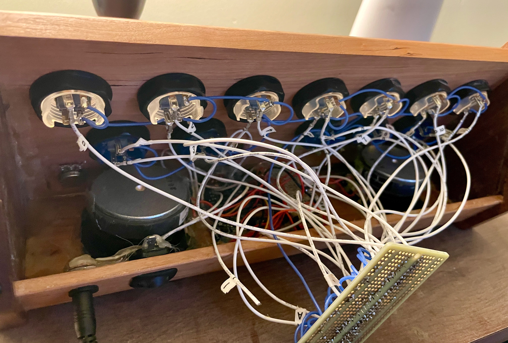

# music-box

a simple raspberry pi based music toy i made for my daughter. i can't devote much time to it,
so it will probably be a poorly documented work in progress for a while.

## hardware

this is a partial list, but here are the primary components:
* 1x - [pi zero w](https://www.adafruit.com/product/3400)
* 2x - [MCP23017](https://www.adafruit.com/product/732)
* 1x - [adafruit i2s stereo decoder](https://www.adafruit.com/product/3678)
* 1x - [adafruit 20w class D amp](https://www.adafruit.com/product/1752)
* 7x - [clear 30mm arcade buttons](https://www.adafruit.com/product/3491)
* 5x - [blue 30mm arcade buttons](https://www.adafruit.com/product/3490)

